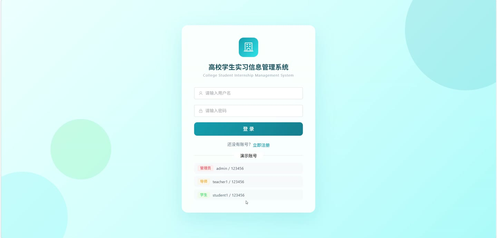
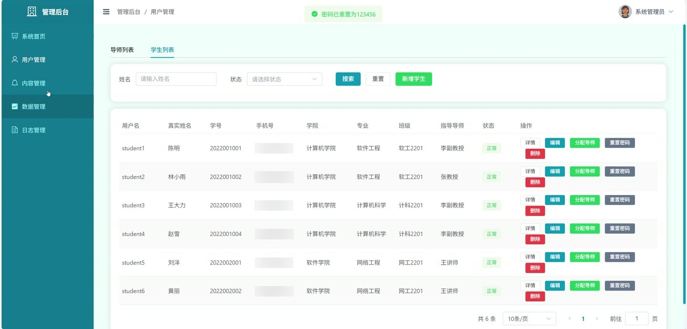
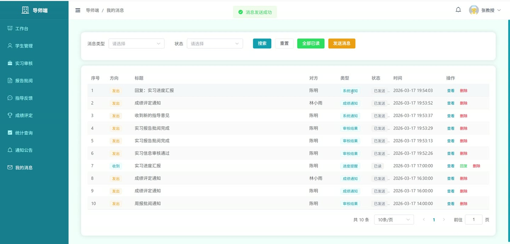
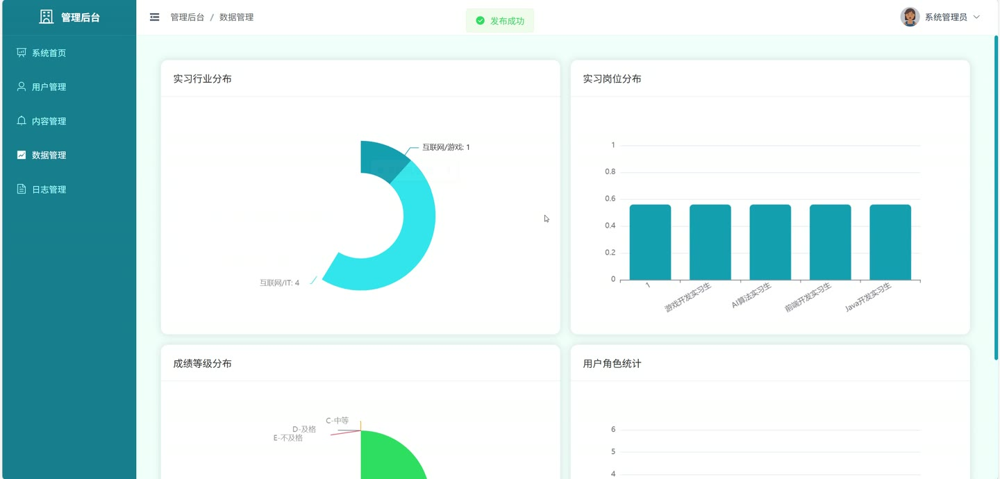
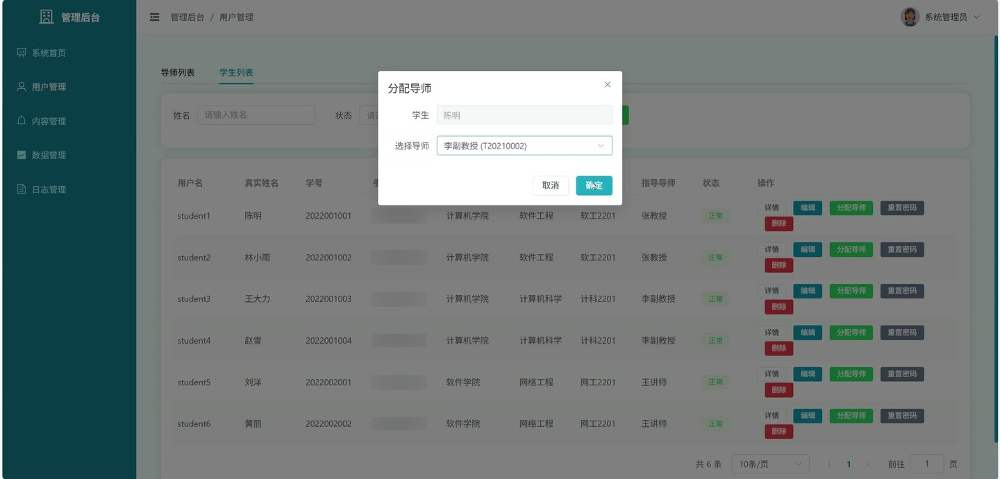
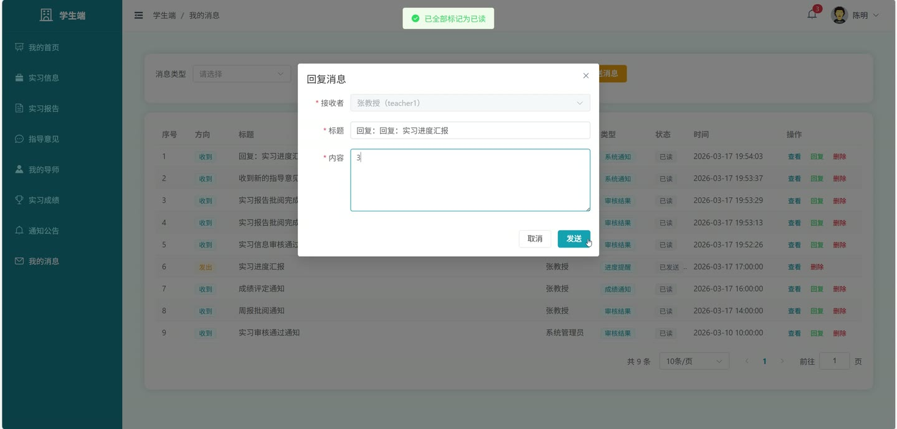

# (附文档)Springboot3+Vue3+MySQL 高校学生实习信息管理系统

**技术栈**：Springboot3、Vue3、MySQL

### 系统简介

本系统是一套基于 SpringBoot3 + Vue3 前后端分离架构的高校学生实习信息管理系统，支持学生、导师、管理员三种角色协同工作。系统围绕实习全流程管理设计，涵盖实习信息申报与审核、实习报告提交与批阅、指导意见发送、实习成绩评定、消息通知、操作日志审计等核心业务模块，满足高校实习教学管理的信息化需求。
 
### 核心功能
 
### 普通用户端

 
- 用户注册：填写用户名、密码、真实姓名、角色（学生/导师）、学号/工号、学院、专业等信息完成注册，注册后账号默认为待审核状态。 
- 用户登录：输入用户名和密码进行登录，系统校验账号状态（禁用/待审核/驳回）并返回 JWT Token。 
- 查看个人信息：获取当前登录用户的详细信息，包括用户名、真实姓名、角色、手机号、邮箱、头像、学院、专业、班级等。 
- 编辑个人信息：修改真实姓名、手机号、邮箱、头像、性别、学院、专业、班级等字段。 
- 修改密码：输入原密码和新密码，系统校验原密码正确性后进行密码更新。 
- 查看我的导师（学生）：获取当前学生所分配的导师详细信息（姓名、工号、学院等）。 
- 查看通知公告：分页浏览已发布的实习通知、政策文件、系统公告，支持按标题和类型筛选。 
- 查看消息列表：分页查看收到的和发出的消息，支持按消息类型（系统通知/审核结果/进度提醒/成绩通知）和已读/未读状态筛选。 
- 标记消息已读：单条标记消息为已读，或一键全部标记为已读。 
- 查看未读消息数量：顶部导航实时显示未读消息条数。 
- 发送消息：向其他用户发送站内消息。 
- 文件上传：上传图片或附件，系统自动按日期分目录存储并返回访问 URL。
 
### 学生端

 
- 提交实习信息：填写实习单位名称、岗位、行业、起止日期、联系人、联系电话、单位地址、实习描述等信息提交实习申请，系统自动关联分配的导师。 
- 查看我的实习信息列表：分页查看本人提交的所有实习信息，支持按公司名称、审核状态、实习状态筛选。 
- 查看实习详情：查看单条实习信息的完整内容，包括学生姓名、学号、导师姓名等。 
- 更新实习信息：修改已提交的实习信息内容。 
- 删除实习信息：删除本人提交的实习记录。 
- 更新实习状态：在实习信息审核通过后，操作实习状态流转（未开始 → 进行中 → 已完成），系统校验状态顺序。 
- 提交实习报告：填写报告标题、内容、周次、上传附件，提交后自动关联导师。 
- 查看我的实习报告列表：分页查看本人提交的所有报告，支持按审核状态和标题筛选。 
- 更新实习报告：修改已提交的报告内容。 
- 删除实习报告：删除本人提交的报告记录。 
- 查看我的实习成绩：查询本人的实习成绩详情，包括综合成绩、工作态度分、专业能力分、报告质量分、等级、评语。 
- 查看指导意见列表：分页查看导师发送的指导意见，支持按导师、类型筛选。 
- 标记指导意见已读：阅读后将指导意见标记为已读。
 
### 导师端

 
- 查看分配的学生列表：获取分配给本人的所有学生信息（姓名、学号、学院、专业、班级、电话）。 
- 审核实习信息：对待审核的实习申请进行审核操作（通过/驳回），填写审核意见，系统自动发送审核结果消息给学生。 
- 查看实习信息列表：分页查看名下学生的实习信息，支持按学生、公司名称、审核状态、实习状态筛选。 
- 批阅实习报告：对待批阅的实习报告进行批阅，填写批阅意见和评分，系统自动发送批阅结果消息给学生。 
- 查看实习报告列表：分页查看名下学生提交的报告，支持按学生、审核状态、标题筛选。 
- 评定实习成绩：对学生进行实习成绩评定，输入工作态度分、专业能力分、报告质量分、综合成绩、等级和评语，系统自动发送成绩通知消息。 
- 查看成绩列表：分页查看名下学生的实习成绩，支持按学生和等级筛选。 
- 发送指导意见：选择学生，填写指导标题、内容和类型（计划审核/日志审核/改进建议/其他），系统自动发送消息通知学生。 
- 查看指导意见列表：分页查看本人发送的指导意见记录。 
- 删除指导意见：删除已发送的指导意见。 
- 查看实习统计图表：按行业统计和按岗位统计名下学生的实习分布情况。
 
### 管理员端

 
- 用户管理 - 分页查询：按真实姓名、角色（学生/导师）、状态筛选用户列表，不显示管理员账号。 
- 用户管理 - 新增用户：添加学生或导师账号，不允许新增管理员。 
- 用户管理 - 编辑用户：修改用户的基本信息。 
- 用户管理 - 删除用户：删除指定用户账号。 
- 用户管理 - 审核用户：对待审核的用户进行审核通过或驳回操作。 
- 用户管理 - 重置密码：将指定用户的密码重置为 123456。 
- 用户管理 - 分配导师：为学生分配指定的导师，校验学生和导师状态。 
- 通知公告管理 - 发布公告：填写标题、内容、类型（实习通知/政策文件/系统公告）、附件和封面图片发布通知。 
- 通知公告管理 - 编辑公告：修改已发布或草稿状态的公告。 
- 通知公告管理 - 删除公告：删除指定公告。 
- 操作日志管理 - 分页查询：按用户名、操作模块、操作状态筛选查看系统操作日志。 
- 操作日志管理 - 删除日志：单条删除或批量删除操作日志。 
- 操作日志管理 - 清空日志：一键清空所有操作日志。 
- 查看系统统计数据：查看学生总数、导师总数、待审核用户数等概览数据。
 
### 技术栈

  后端框架 Spring Boot 3.x   ORM 框架 MyBatis-Plus   权限认证 JWT (jjwt)   前端框架 Vue 3   状态管理 Pinia   构建工具 Vite   数据库 MySQL   工具库 Hutool、Jackson 
 
### 交付内容

 
- 后端完整源码 
- 前端完整源码 
- 数据库初始化脚本 
- 万字文档

## 界面展示

---

## 获取完整源码 + 万字文档

本仓库为项目介绍页。**完整前后端源码、数据库初始化脚本、万字项目文档**，请访问 [codekk.top](http://codekk.top) 获取。

可作课程设计 / 毕业设计参考，支持远程部署调试。